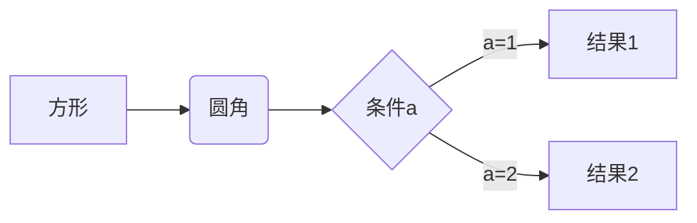
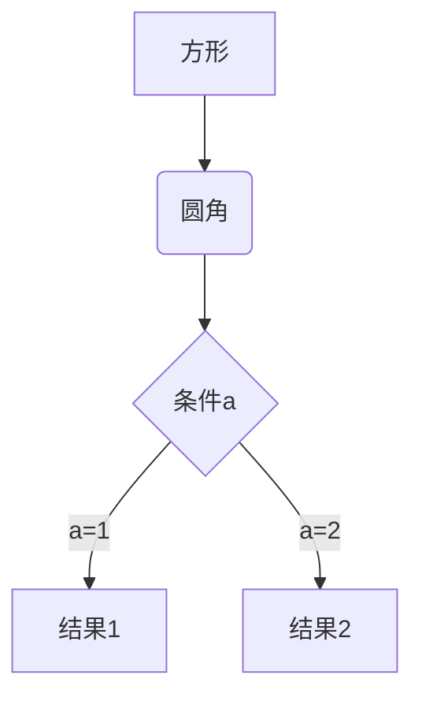
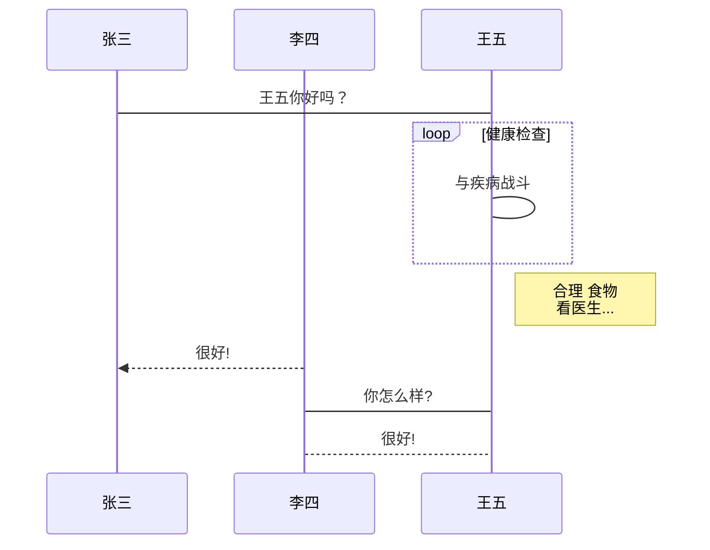
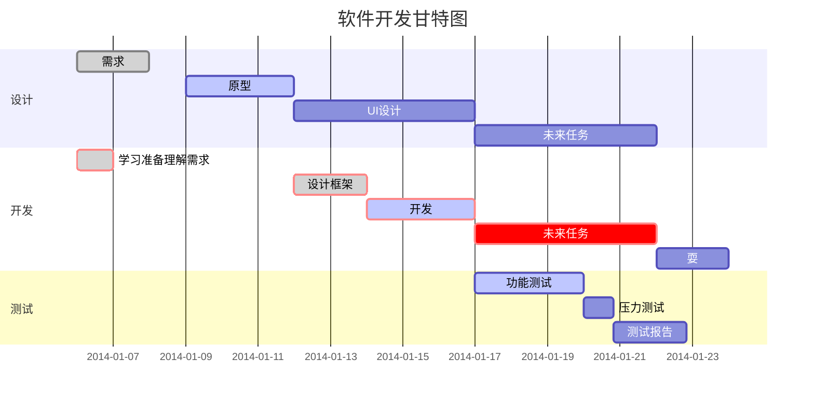

# AutoTest
APIAutoTest
* 华为机试高频题目:https://blog.csdn.net/weixin_44052055/article/details/123930856
* testcafe:https://github.com/mutoe/blog/blob/master/source/_posts/testcafe.md
***
# 练习一级标题
##  练习二级标题
###  练习三级标题
####  练习四级标题
#####  练习五级标题
######  练习六级标题
***

** 这是加粗字体**

***
*这是斜体 *

***
***这是斜体加粗***

***
~~这是删除线~~

***
>这是代表引用内容
>
>>>>这是代表引用内容

***

这是分割线

---

图片语法:    图片alt就是显示在图片下面的文字，相当于对图片内容的解释。图片title是图片的标题，当鼠标移到图片上时显示的内容。title可加可不加


***
[超链接名](超链接地址 "超链接title")
[youtube](https://www.youtube.com/ "油管连接")

***
+ 无序列表
- 无序列表
* 无序列表    **注意：- + * 跟内容之间都要有一个空格 **
1. 有序列表1
2. 有序列表2
3. 有序列表3   **注意：序号跟内容之间要有空格**
   列表嵌套  **上一级和下一级之间敲三个空格即可**
* 无序列表嵌套2层无序，无序再嵌套有序
    * 第一层{1}
        * 第二层(1)
            1. 第三层有序列表<1>
            2. 第三层有序列表<2>
        * 第二层(2)
            1. 第三层有序列表<1>
            2. 第三层有序列表<2>

    * 第一层{2}
---

表格语法
表头|表头|表头
---|:--:|---:
内容|内容|内容
内容|内容|内容

第二行分割表头和内容。
- 有一个就行，为了对齐，多加了几个
  文字默认居左
  -两边加：表示文字居中
  -右边加：表示文字居右
  **注：原生的语法两边都要用 | 包起来。此处省略**
  姓名|技能|排行
  ---|:--:|--:
  刘备|哭|大哥
  关羽|打|二哥
  张飞|骂|三弟
***

**代码语法**
单行代码：代码之间分别用一个反引号包起来
代码块: 代码之间分别用三个反引号包起来 **防止转义，使用()括起来反引号
`print("Hello Python")`

```java
public static void main(String[] args) {
        System.out.println("Hello Java");
    }
```
***

**流程图语法**
1.  横向流程图源码格式：

2. 竖向流程图源码格式：

3. 标准流程图源码格式：
```flow
st=>start: 开始框
op=>operation: 处理框
cond=>condition: 判断框(是或否?)
sub1=>subroutine: 子流程
io=>inputoutput: 输入输出框
e=>end: 结束框
st->op->cond
cond(yes)->io->e
cond(no)->sub1(right)->op
```
4. 标准流程图源码格式（横向）：
```flow
st=>start: 开始框
op=>operation: 处理框
cond=>condition: 判断框(是或否?)
sub1=>subroutine: 子流程
io=>inputoutput: 输入输出框
e=>end: 结束框
st(right)->op(right)->cond
cond(yes)->io(bottom)->e
cond(no)->sub1(right)->op
```
5. UML时序图源码样例：
```sequence
对象A->对象B: 对象B你好吗?（请求）
Note right of 对象B: 对象B的描述
Note left of 对象A: 对象A的描述(提示)
对象B-->对象A: 我很好(响应)
对象A->对象B: 你真的好吗？
```
6. UML时序图源码复杂样例：
```sequence
Title: 标题：复杂使用
对象A->对象B: 对象B你好吗?（请求）
Note right of 对象B: 对象B的描述
Note left of 对象A: 对象A的描述(提示)
对象B-->对象A: 我很好(响应)
对象B->小三: 你好吗
小三-->>对象A: 对象B找我了
对象A->对象B: 你真的好吗？
Note over 小三,对象B: 我们是朋友
participant C
Note right of C: 没人陪我玩
```
7. UML标准时序图样例：

8. 甘特图样例：

